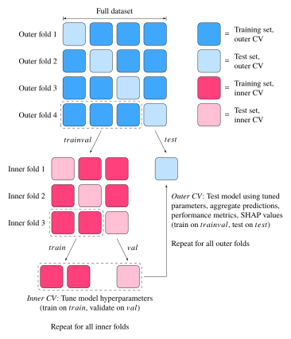

# ncnt-random-forest
Random forest (RF) machine learning implementation written in Python for learning and analyzing hydrogen adsorption properties of defective nitrogen doped carbon nanotubes.

## Usage

```bash
$ rndforest.py [-h] -i INPUT [--n_estimators N_ESTIMATORS] [--max_features MAX_FEATURES] [--max_depth MAX_DEPTH] [--min_samples_split MIN_SAMPLES_SPLIT] [--cv_folds CV_FOLDS] [--inner_folds INNER_FOLDS] [--shap SHAP] [--random_search] [--n_iter N_ITER]
```

The script expects a pandas ```DataFrame``` (stored as ```.csv```) as input. The number of outer cross-validation (CV) folds, inner CV folds, decision trees in the RF and random features considered when splitting each node are optionally provided using the ```--cv_folds```, ```--inner_folds```, ```--n_estimators``` and ```--max_features``` flags, respectively. The maximum decision tree depth and minimum number of samples required to split an internal node are specified using the ```--max_depth``` and ```--min_samples_split``` flags.

Randomized hyperparameter search is conducted within the inner CV loop if ```--inner_folds``` is specified. For a non-nested (only outer CV) variant yielding a single optimized model, the ```--random_search``` flag should be given. In both cases, the number of parameter iterations is provided using the ```--n_iter``` flag. Integer ```--shap``` arguments activates the calculation of SHAP values for all outer CV test set samples, requiring that also ```--inner_folds``` is given. Negative ```--shap``` arguments trigger also the computation of SHAP interaction values.

To improve the computational performance, the hyperparameter optimization within the inner CV loop is parallelized using ```--n_iter``` CPUs, or the maximum amount available. The SHAP analysis is sped up using the GPU accelerated version of the TreeSHAP algorithm.


